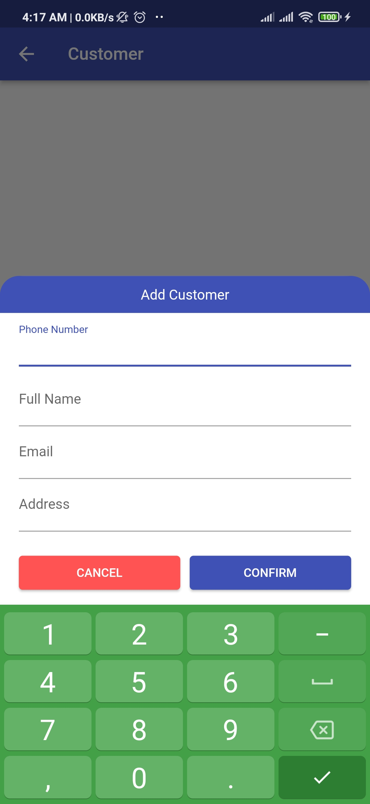
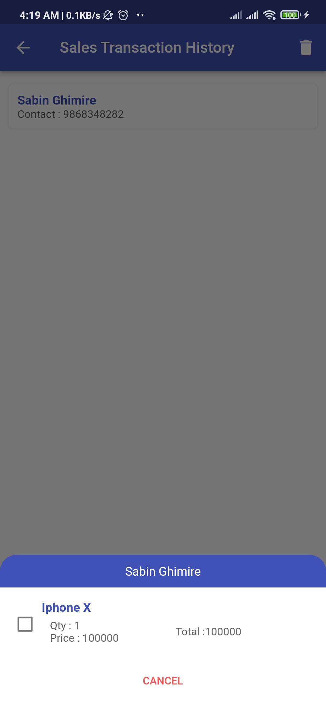
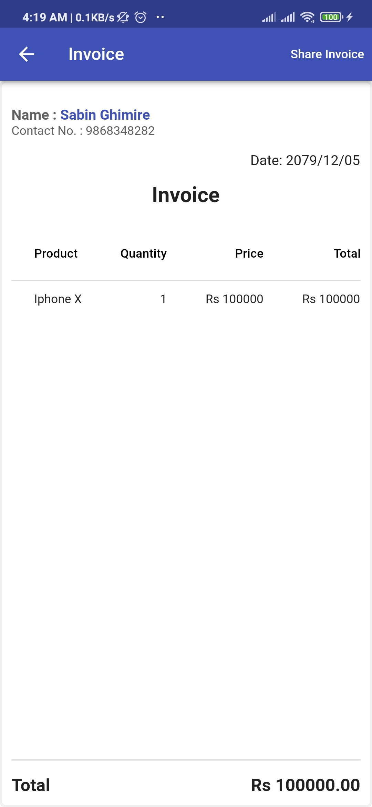
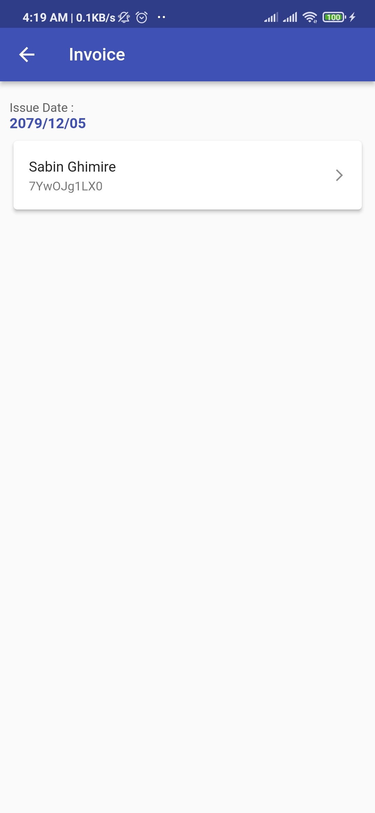

# App Usage Instructions

This app is built using Flutter with GetX and can be used on Android or iOS devices by downloading the APK and installing it on the device. Please note that the app has only been tested on an Android device, specifically a Readme Note 7.

You can download the [APK from here](https://drive.google.com/file/d/1b8csRODkjKuF-XMBlmkhr7LhdsaoljbX/view?usp=sharing).

## App ScreenShots

## Steps to Use

### Step 1: Create Multiple Customers

To create multiple customers, go to the Customer section, click on "Add Customer," and confirm.

### Step 2: Insert Multiple Products

To insert multiple products, go to the Product section, click on "Add Product," and confirm.

### Step 3: Make Sales Transactions

Now go to the Sales Transaction section where you can make multiple operations. Follow these steps:

#### 3.1 Select a Customer and Product

After clicking on the Sales Transaction section, you will see a form section where you can select a customer and product.

1. Click on the "Select Customer" dropdown and choose a customer using their phone number.
2. Click on the "Product" dropdown and select a product.
3. A pop-up will appear, enter the quantity and confirm.
4. You will see two buttons at the bottom of the screen:
    - Cancel: For declining the operation and clearing all selections
    - Confirm: For saving the sales transaction and clearing all selections.

#### 3.2 View Saved Sales Transactions

On the app bar of the same page, you will see a round button. Click on it to navigate to a new page where you can see the saved sales transaction list.

1. Select an item, and it will show the product list to choose for bill generation.
2. Confirm it, and it will generate an invoice.

### Step 4: View Generated Invoices

Go to the Invoice section, and you will see all the generated invoices according to the Bill Generated Date with customer name and transaction number of the product.

1. Select an item from the list, and it will show the invoice of transaction details.

## Conclusion

Follow these steps to effectively use this app for your sales transactions. If you encounter any issues or have any questions, please refer to the app documentation or contact support at sabin.ghimire1827@gmail.com
